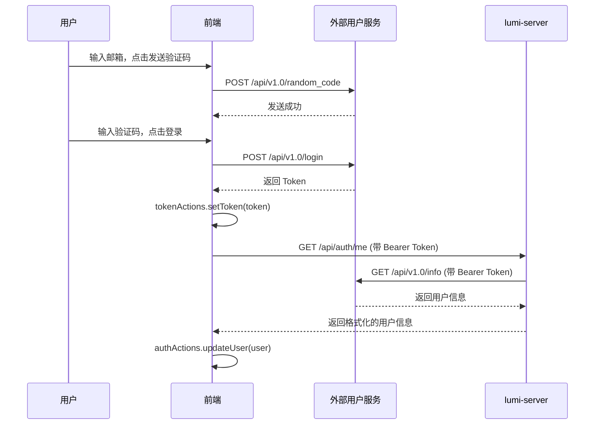
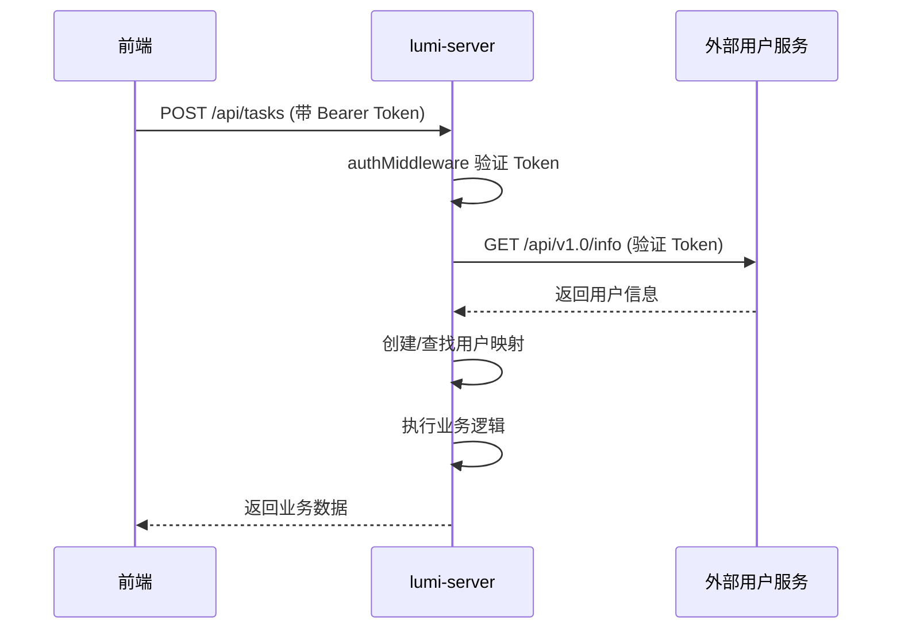

# 外部用户服务集成文档

## 概述

本项目使用外部用户服务（user.ai3d.top）进行用户认证和管理。后端提供代理接口，统一处理认证和响应格式转换。

## 架构设计

```
┌─────────────┐      登录/注册      ┌──────────────────┐
│   前端      │ ──────────────────> │  外部用户服务    │
│ (lumi-web)  │                     │ (user.ai3d.top)  │
└─────────────┘                     └──────────────────┘
      │
      │ 用户信息管理
      │ (需要 Token)
      ▼
┌─────────────┐      代理请求       ┌──────────────────┐
│   后端      │ ──────────────────> │  外部用户服务    │
│(lumi-server)│ <────────────────── │ (user.ai3d.top)  │
└─────────────┘      返回数据       └──────────────────┘
```

## 接口分类

### 1. 前端直接调用（无需 Token）

这些接口前端直接调用外部用户服务，不经过 lumi-server：

| 接口 | 方法 | 说明 |
|------|------|------|
| `/api/v1.0/random_code` | POST | 发送邮箱验证码 |
| `/api/v1.0/register` | POST | 用户注册 |
| `/api/v1.0/login` | POST | 用户登录 |

**前端调用示例**：
```typescript
import { buildApiUrl } from '@/lib/config/api';

// 发送验证码
const response = await fetch(buildApiUrl('/api/v1.0/random_code', 'user'), {
  method: 'POST',
  headers: { 'Content-Type': 'application/json' },
  body: JSON.stringify({
    email: 'user@example.com',
    type: 'login', // 'login' | 'register' | 'modify_password'
  }),
});

// 注册
const response = await fetch(buildApiUrl('/api/v1.0/register', 'user'), {
  method: 'POST',
  headers: { 'Content-Type': 'application/json' },
  body: JSON.stringify({
    email: 'user@example.com',
    random_code: '123456',
  }),
});

// 登录
const response = await fetch(buildApiUrl('/api/v1.0/login', 'user'), {
  method: 'POST',
  headers: { 'Content-Type': 'application/json' },
  body: JSON.stringify({
    login_type: 'code',
    email: 'user@example.com',
    random_code: '123456',
  }),
});
// 响应: { code: 200, msg: "success", data: "token_string" }
```

### 2. 通过后端代理调用（需要 Bearer Token）

这些接口前端调用 lumi-server，后端代理到外部用户服务：

| lumi-server 接口 | 方法 | 外部服务接口 | 说明 |
|-----------------|------|-------------|------|
| `/api/auth/me` | GET | `/api/v1.0/info` | 获取当前用户信息（特殊格式）|
| `/api/users/info` | GET | `/api/v1.0/info` | 获取当前用户信息（原始格式）|
| `/api/users/:id` | GET | `/api/v1.0/:id` | 获取指定用户信息 |
| `/api/users/update` | POST | `/api/v1.0/update` | 更新用户信息 |
| `/api/users/logout` | POST | `/api/v1.0/logout` | 用户登出 |
| `/api/users/modify-password` | POST | `/api/v1.0/modify_password` | 修改密码 |

**前端调用示例**：
```typescript
import { apiClient, apiPost } from '@/lib/api-client';

// 1. 获取当前用户信息（特殊格式，用于认证状态）
const response = await apiClient('/api/auth/me', {
  context: 'general',
});
// 响应:
// {
//   status: "success",
//   data: {
//     status: "authenticated",
//     user: {
//       id: "9INUE97j",
//       email: "user@example.com",
//       userName: "username",
//       nickName: "nickname",
//       avatar: "base64_string",
//       gender: "male"
//     }
//   }
// }

// 2. 获取当前用户信息（原始格式）
const response = await apiClient('/api/users/info', {
  context: 'general',
});
// 响应:
// {
//   status: "success",
//   data: {
//     user_id: "9INUE97j",
//     user_name: "username",
//     nick_name: "nickname",
//     email: "user@example.com",
//     avatar: "base64_string",
//     gender: "male"
//   }
// }

// 3. 获取指定用户信息
const response = await apiClient('/api/users/9INUE97j', {
  context: 'general',
});

// 4. 更新用户信息
const response = await apiPost('/api/users/update', {
  id: '9INUE97j',
  nick_name: '新昵称',
  avatar: 'base64_string',
  gender: 'female',
}, {
  context: 'general',
});

// 5. 登出
const response = await apiPost('/api/users/logout', {}, {
  context: 'general',
});

// 6. 修改密码
const response = await apiPost('/api/users/modify-password', {
  id: '9INUE97j',
  old_password: 'old_pass', // 首次修改可为空
  new_password: 'new_pass',
  repassword: 'new_pass',
  random_code: '123456', // 需要先调用 random_code 接口
}, {
  context: 'general',
});
```

## 认证流程

### 1. 用户登录流程



### 2. 业务请求流程（需要认证）



## 响应格式

### 外部用户服务响应格式

```typescript
{
  code: 200,        // HTTP 状态码
  msg: "success",   // 消息
  data: any         // 数据（可选）
}
```

### lumi-server 响应格式（JSend）

```typescript
// 成功
{
  status: "success",
  data: any
}

// 失败
{
  status: "fail",
  data: {
    code: "ERROR_CODE",
    message: "错误描述"
  }
}

// 错误
{
  status: "error",
  message: "错误描述"
}
```

## 环境变量配置

### lumi-server (.env)
```bash
# 外部用户服务 URL
USER_SERVICE_URL=http://user.ai3d.top
```

### lumi-web-next (.env)
```bash
# 业务 API（lumi-server）
NEXT_PUBLIC_API_BASE_URL=http://192.168.88.100:3000

# 用户服务 API（直接访问）
NEXT_PUBLIC_USER_API_BASE_URL=http://user.ai3d.top
```

## 注意事项

1. **Token 管理**
   - 登录后前端保存 Token 到 localStorage
   - 所有需要认证的请求都需要携带 Bearer Token
   - Token 失效时自动弹出登录弹窗

2. **CORS 配置**
   - 外部用户服务需要配置 CORS 允许前端域名
   - lumi-server 需要配置 CORS 允许前端域名

3. **错误处理**
   - 401 错误：Token 失效，清除本地 Token，弹出登录弹窗
   - 其他错误：显示错误消息

4. **用户 ID 映射**
   - lumi-server 维护 `external_user_id` ↔ `local_id` 映射
   - 业务数据使用 `local_id`（内部 UUID）
   - 用户信息使用 `external_user_id`

## API 文档

- 外部用户服务：见 OpenAPI 文档
- lumi-server：访问 http://localhost:3000/docs 查看 Scalar API 文档
